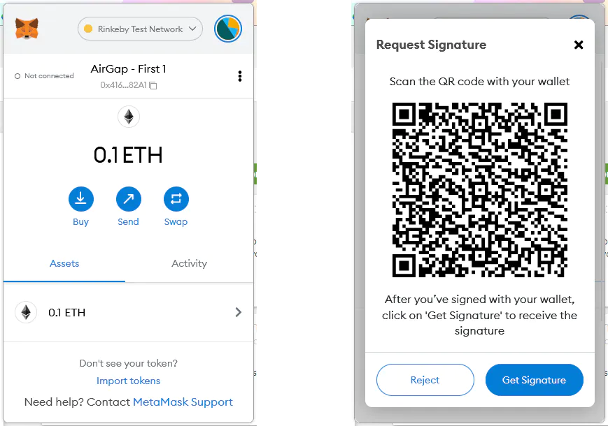

# Moto E2 → HWW 🔒

Hace rato que vengo pensando en la posiblidad de utilizar un Moto E2 que tengo sin uso en una hardware wallet. La semana pasada me lancé a ello y vengo a contar cual fue mi experiencia.

## Método

Indagando en las distintas posibilidades para lograr el objetivo, me crucé con [↗AirGap Vault](https://airgap.it/), una aplicación que te permite generar una private key, exportarla a MetaMask y utilizar nuestro celular para firmar las transacciones mediante códigos QR. De forma inconsicente esto era lo que estaba buscando así que me convenció en un 100% y es el método que elegí. La app también nos permite crear wallets para Bitcoin (hasta segwit), Tezos, Polkadot, Cosmos, entre otras. Personalmente solo probé las wallets de Ethereum (EVM), no sé que tal funcionan las otras redes, y tampoco me gusta que todavía no admita taproot para BTC. Al tratar de usar la aplicación, me encontré con que nunca terminaba de abrir, después de un googleo rápido encontré que era porque debía actualizar Android System Webview. Después de actualizarlo la aplicación abrió de forma normal. Pueden ver la guía completa para configurar la aplicación en su [↗página de soporte](https://support.airgap.it/airgap-vault/introduction).

**Aclaración:** si bien en teoría estamos creando una wallet air gapped, la única manera de hacerla 100% air gapped es sacando todas las antenas del dispositivo.

## Dispositivo

Utilicé un Moto E2, precisamente el modelo XT1511, un dispositivo que salió en 2015 y se quedó en Android 5.0.1. Lo tenía rooteado y con una custom ROM, lo cual me impidió realizar el proceso, por lo que tuve que desrootearlo y volver a la rom stock. También tuve en cuenta algunas cosas para hacerlo lo más “seguro” posible:

- Modo avión activado en todo momento
- Encriptarlo y ponerle un PIN
- Instalar las apps vía APKs descargados de forma segura

## Resultado

Finalmente, con la aplicación instalada, pude generar las 24 palabras, generar una wallet de Ethereum, exportarla hacia MetaMask efectivamente, al hacer una transacción me pide firmarla mediante un código QR:

El problema llegó acá, nunca pude abrir la parte de "Scan" para escanear el QR y firmar la transacción. No tengo dudas que la app funciona y el problema reside en mi dispositivo, en la versión del sistema o cualquier otra cosa.

---

En conclusión, hay un método bastante sencillo para crear wallets “air gapped” con un celular viejo. Así que si tenés uno tirado, este es un buen uso que le podés dar y de paso le sumás un poco de seguridad a tu operativa en crypto.
