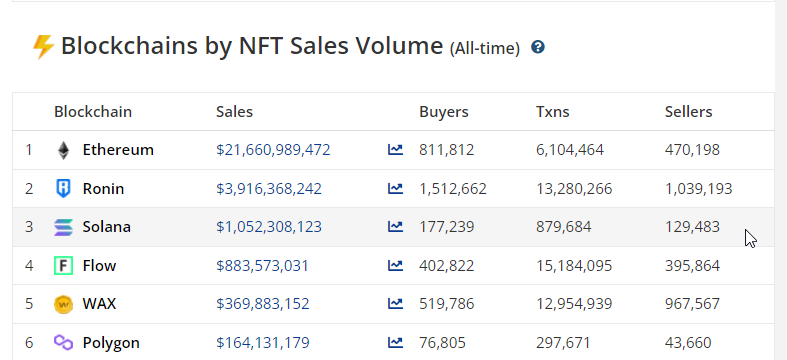
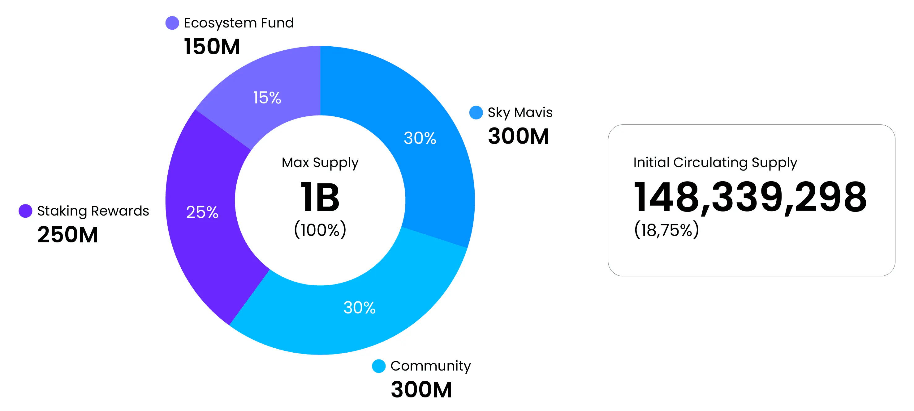
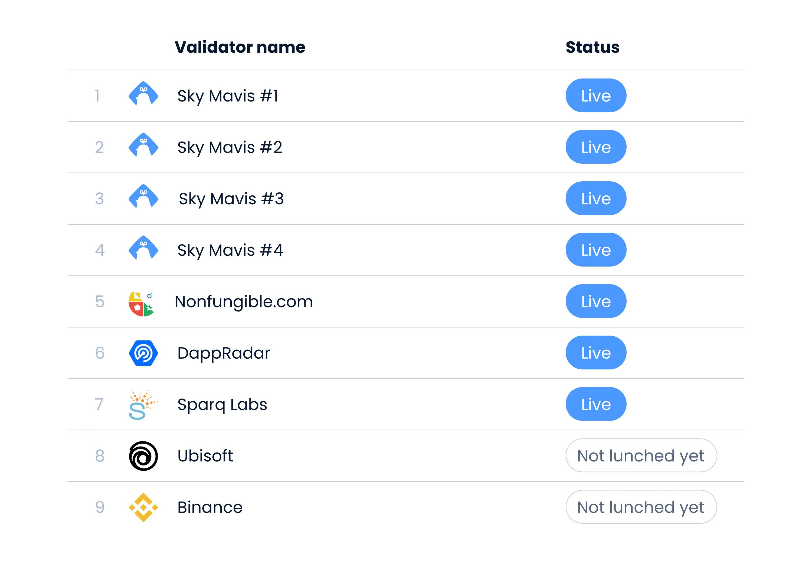

# $RON: ¿rumbo a la descentralización?

El día de la fecha se lanzó $RON, el token nativo de Ronin Network, la sidechain que alberga las transacciones del exitoso juego Axie Infinity. En este artículo te voy a explicar por qué esto es importante y como afecta al futuro de la red.

## Punto de partida

Antes que nada, debemos entender la situación de Ronin Network para ver hacia el futuro. Ronin es una sidechain de Ethereum, creada para desarrolladores que quieren construir juegos basados en la web3. Antes de su creación, el crecimiento de Axie Infinity estuvo limitado a la escabilidad de Ethereum, en el primer mes operativo de Ronin, Axie experimentó:

- +300% en volumen de trading de NFTs mensual
- +180% en traders únicos de NFTs
- +131% de jugadores activos a diario

Y tan solo 9 meses después del lanzamiento Ronin acumuló:

- 250.000 usuarios activos diariamiente
- 5 mil millones de dólares de valor depositado
- El segundo DEX con más usuarios activos semanalmente
- El 15% de las transacciones de NFT hechas en 2021
- 2 millones de descargas en la extensión de Ronin Wallet

Como podemos ver, Ronin generó un crecimiento increíble, y esto es principalmente por sus transacciones baratas (en un inicio gratuitas), su facilidad para meter fiat on-ramp y más ventajas.

En un futuro Sky Mavis va a liberar la red para que cualquier desarrollador pueda construir su juego dentro del ecosistema, aprovechando todas las ventajas que este le trae.

## Distribución del token

Los validadores de Ronin van a necesitar holdear y stakear $RON para poder validar bloques. A su vez, los usuarios van a poder stakear $RON en un validador para recibir recompensas y participar de la gobernanza de la red. El supply máximo de RON es 1.000.000.000 (cantidad que se alcanzará 294 meses luego de que empiece su emisión) y su distribución es la siguiente:

Acá vemos que el 30% de los tokens van a ir a Sky Mavis, lo que los deja con un poder bastante grande dentro de la red. Ellos se refieren a Ronin como una red que en un inicio es proof-of-authority, donde ellos son la autoridad que van controlando lo que sucede en ella y luego pasa a un esquema proof-of-stake, donde todo el que cumpla los requisitos va a poder correr un validador.

## Validadores

Por lo comentado anteriormente, actualmente para correr un nodo validador, se necesita el permiso Sky Mavis. Actualmente conocemos nueve nodos validadores, de los cuales cuatro los corre Sky Mavis:

Supuestamente en un futuro se podrán correr validadores "libremente", y para ello se va a necesitar un hardware específico, [que pueden consultar acá](https://litepaper.roninchain.com/validators/running-a-ronin-node) y tener en staking la cantidad de 50.000 $RON. En la página donde se especifica esto, aclaran: "Si un validador falla en la producción de bloques, su stake de $RON puede ser reducido. Lo mismo sucede con el $RON stakeado por los usuarios, así que elige con cuidado donde lo stakeas."

## Descentralización

En su litepaper, ellos dicen que la descentralización es un tema clave en para que las comunidades digitales engan el control de sus datos, identidad y propiedades digitales. Por eso en 2022 van a añadir la posibilidad de pedir el permiso para correr un validador y la posibilidad de desarrollar dentro de Ronin. Según describen, este proceso se va a dividir en las siguientes tres fases:

### Fase 1

- Al menos diez validadores ajenos a Sky Mavis
- Al menos tres equipos externos creando juegos o experiencias NFT dentro de Ronin

### Fase 2

- Ronin pasa a utilizar el esquema proof-of-stake
- Los validadores tienen poder de voto sobre los contratos que son lanzados dentro de la red
- Al menos cinco equipos externos creando juegos o experiencias NFT dentro de Ronin
- Al menos veinte validadores ajenos a Sky Mavis

### Fase 3

- Ronin actualiza su consenso basandose en los avances de escalabilidad y seguridad.
- Más de 100 validadores
- Las comisiones de protocolos y ventas de NFT fuera del universo de Axie serán enviadas a los validadores para que las compartan con los usuarios que hayan delegado su $RON

## Mi opinión

Llegamos a la parte menos importante de este artículo, mi opinión. Personalmente me parece genial y necesaria la iniciativa de Sky Mavis en pos de la descentralización de Ronin, ya que se alinea a la idea de propiedad digital realmente en manos del usuario. Los requisitos de hardware son bastante parecidos a lo que necesita uno para correr un nodo en Ethereum, pero el requisito de $RON en staking me parece bastante alto, más teniendo en cuenta el precio que puede llegar a tener el token en un futuro. También poniendo el ojo en la distribución del token, que el 30% vaya hacia Sky Mavis es signo de una descentralización bastante limitada, lo cual me parece cuestionable, porque por ahora los usuarios no son propietarios de nada realmente, en caso de que un gobierno decida perseguir a Sky Mavis se perdería todo lo que está adentro, pero entendible porque la empresa necesita este poder para poder terminar de desarrollar su juego. Me parece muy interesante el punto de la fase 3 donde se promete actualizar la red basandosé en los avances de escalabilidad y seguridad, lo cual puede significar un cambio en los requisitos para validar migrando a un esquema de zk-rollups o algo similar. Veremos que nos depara el futuro, que estoy seguro que será muy gratificante.

---

## Fuentes

- [Ronin Network Litepaper](https://litepaper.roninchain.com/)
